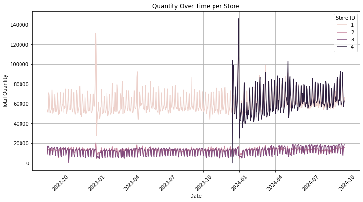
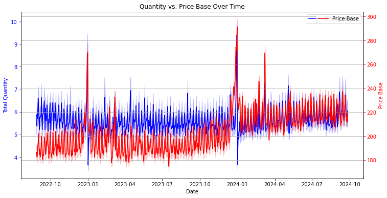
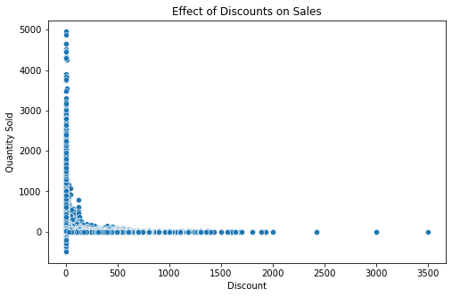
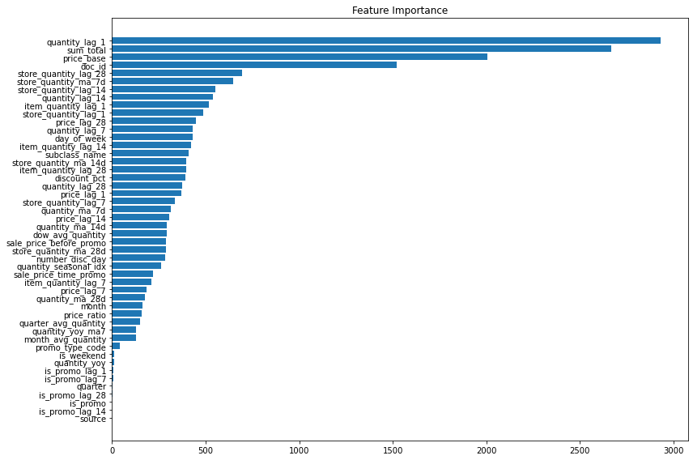

## PHASE 5 CAPSTONE PROJECT

## TOPIC: Retail Demand Forecast

### Project Overview
<<<<<<< HEAD
We proposed to develop a machine learning solution to accurately forecast customer demand across multiple retail locations, optimizing inventory management and reducing operational inefficiencies. Using 25 months of historical sales data from four stores, we'll create predictive models that capture complex patterns in customer purchasing behavior, price sensitivity, and promotional impacts.
=======
We propose to develop a machine learning solution to accurately forecast customer demand across multiple retail locations, optimizing inventory management and reducing operational inefficiencies. Using 25 months of historical sales data from four stores, we'll create predictive models that capture complex patterns in customer purchasing behavior, price sensitivity, and promotional impacts.
>>>>>>> 3eec127de80664979028e58fcc69bf9f97b6e9f2
### Objectives
1. Develop a machine learning model that accurately predicts product demand across multiple store locations.

2. Identify Key Factors influencing customer purchasing patterns

3. Understand the impact of pricing strategies, promotions and markdowns on sales volumes
### Data Sources
The project integrates diverse data sources, including in-store and online sales, price changes, markdowns, promotional history, product catalog information, and store-specific details. Our analysis will leverage datasets spanning 25 months of historical sales data from four retail stores:

<<<<<<< HEAD
Source Link: https://www.kaggle.com/competitions/ml-zoomcamp-2024-competition/data

### Technical Approach
1.	Data Preparation 
    1.Negative values in the sales columns (quantity, priceBase, sum_total) Action: Drop rows
    2.Covert date column for all dataframes into date_time
    3.introduce a column called source in the sales data
    4.merge online_sales and offline_sales as they have the same column names

2.	Feature Engineering 
o	EDA & visualization

o	Develop temporal features (trends, seasonality)
We aggregated features at different levels (store, item, department, and class) to capture sales trends across multiple hierarchies. 
These aggregations help in understanding demand patterns at various granularities, improving forecast accuracy.

- Store-level: Captures overall store demand fluctuations.

- Item-level: Helps in identifying item-specific trends.

- Department/Class-level: Identifies category-wide trends to capture broader market shifts.

3.	Model Development  

We Trained and evaluated a LightGBM model for demand forecasting.
=======
1. In-store Sales Data (sales.csv): Daily sales records including quantity sold, pricing, and revenue metrics
2. Online Sales Data (online.csv): Store-specific e-commerce transaction data
3. Pricing Information: 
o	price_history.csv: Historical price changes by product and store
o	markdowns.csv: Records of discounted product sales
o	discounts_history.csv: Detailed promotional pricing history
4. Product Information: 
o	catalog.csv: Product details including department, class, and specifications
o	actual_matrix.csv: Store-specific product availability data
•	Store Information (stores.csv): Comprehensive store details including format, location, and size
### Technical Approach
1.	Data Preparation 
o	Clean and integrate multiple data sources
o	Handle missing values and outliers
o	Create unified dataset for analysis
2.	Feature Engineering 
o	EDA & visualization
o	Develop temporal features (trends, seasonality)
o	Create price sensitivity metrics
o	Incorporate product and store characteristics
o	Generate lag and rolling window features
3.	Model Development 
o	Implement a machine learning model
o	Apply time series forecasting techniques
o	Evaluate model performance
o	Identify key demand drivers
### Evaluation Metric
•	Model performance will be evaluated using Root Mean Squared Error (RMSE). Lower RMSE values indicate more accurate prediction model.

## STEPS TO BE UNDERTAKEN IN THE RETAIL DEMAND FORECAST
>>>>>>> 3eec127de80664979028e58fcc69bf9f97b6e9f2

Building a sales forecast using Python involves a combination of data preparation, exploration, model creation, and evaluation. Here's a step-by-step guide to help you get started:

### Step 1: Gather and Prepare Data
- Collect historical sales data, including any factors that might influence sales (e.g., seasons, promotions, etc.).
- Load the data into Python using libraries like `pandas`.
- Clean the data by handling missing values, removing duplicates, and formatting date fields.

### Step 2: Perform Exploratory Data Analysis (EDA)
- Use libraries like `matplotlib` and `seaborn` to visualize sales trends.
- Identify patterns, seasonality, or anomalies in the data.
- Analyze correlations between sales and other variables.

### Step 3: Choose a Forecasting Method
Select an appropriate method based on the nature of your data:
- **Time Series Models**: Use methods like ARIMA, SARIMA, or Prophet for temporal patterns.
- **Machine Learning Models**: Use models like Random Forests or Gradient Boosting for more complex datasets.

### Step 4: Prepare Data for the Model
- Split your dataset into training and testing subsets.
- Scale or normalize features if necessary.
- Create lag variables or rolling averages for time series models.

### Step 5: Build and Train the Model
- Use libraries like `statsmodels`, `scikit-learn`, or `fbprophet` to implement your chosen model.
- Train the model using the training dataset.

### Step 6: Evaluate the Model
- Calculate performance metrics like Mean Absolute Error (MAE) or Root Mean Square Error (RMSE).
- Plot predicted vs. actual sales to visually inspect the accuracy.

### Step 7: Make Predictions
- Use your trained model to forecast future sales.
- Visualize the predictions using line plots to see how they align with past trends.

### Step 8: Refine and Deploy
- Iterate by adjusting model parameters or adding more relevant features.
- Deploy the model using tools like Flask, FastAPI, or a cloud platform for real-time forecasting.

### Evaluation Metric
o	Model performance

Validation RMSE: 1.1625

Validation MAE: 0.2745

o	Identifying key retail demand drivers

## Recommendations
1. The customers should leverage the model to determine the true customer demand for a particular product, at a given time to minimize overstocking and avoid stockouts
2. The stores should adapt to market dynamics due to seasonality of demand. For example, all the stores should prepare for the peak sales periods to avoid unexpected market shifts while increasing profitability
3. The stores should not invest heavily into discounts but other sales promotions since they do not impact on sales revenues or quantity sold
4. For inventory optimization, continuous evaluation of the demand forecast is desired based on real-time data

## Deployment

